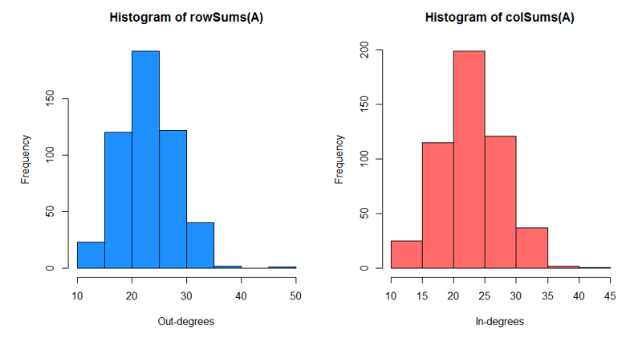
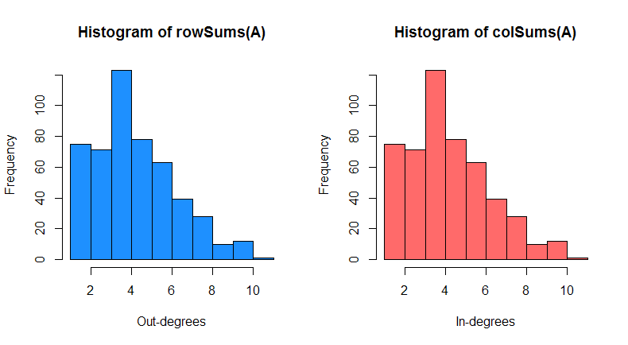
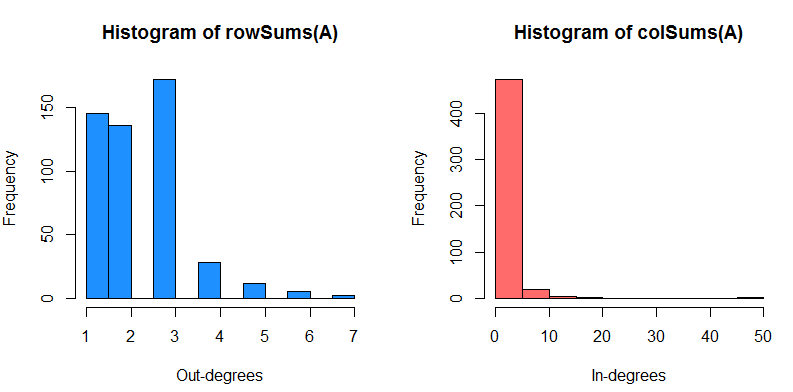
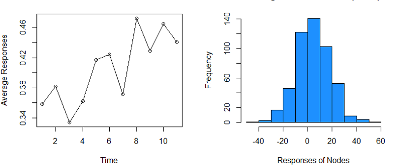

[](http://quantlet.de/index.php?p=info)

## [](http://quantlet.de/) **NAR** [](http://quantlet.de/d3/ia)


```yaml

Name of QuantLet: NAR

Published in: Annals of Statistics (under review)

Description: Generates the network structure, simulate the reponses, and fit the NAR model.

Keywords: Network Analysis, Vector Autoregression, Adjacency Matrix

See also: TENER_Linear, TENET_SIFIs, TENET_SIM, TENET_VaR_CoVaR, TENET_group_network

Author: Xuening Zhu

Submitted: Fri, May 06 2015 by Xuening Zhu

Example: 
- 1: The histogram of in-degrees and out-degrees of Dyad Independence Network
- 2: The histogram of in-degrees and out-degrees of Stochastic Block Network
- 3: The histogram of in-degrees and out-degrees of Power-law Distribution Network
- 4: The time series and histogram of responses 


```











```r

source("simulation/simulator.R")  ### source the simulator file
source("estimator.R")

###################### Generate three network structures
###################### ##########################################
set.seed(2016)

#### Dyad Independence network P(Dij = (1,1)) = 2N1/N; P(Dij = (1,0)) =
#### P(Dij = (0,1)) = 0.5*N^{-0.8}
A = getDyadW(N = 500, N1 = 10, delta = 1.2, normalize = F)
str(A)  # spase matrix
object.size(A)
A = as.matrix(A)
object.size(A)

par(mfrow = c(1, 2))
hist(rowSums(A), col = "dodgerblue", xlab = "Out-degrees")
hist(colSums(A), col = "indianred1", xlab = "In-degrees")

#### Stochastic Block network K is the block numbers
A = getBlockW(N = 500, 5, normalize = F)

par(mfrow = c(1, 2))
hist(rowSums(A), col = "dodgerblue", xlab = "Out-degrees")
hist(colSums(A), col = "indianred1", xlab = "In-degrees")


#### Power-law network alpha is the exponent parameter
A = getPowerLawW(N = 500, alpha = 2.5, normalize = F)

par(mfrow = c(1, 2))
hist(rowSums(A), col = "dodgerblue", xlab = "Out-degrees")
hist(colSums(A), col = "indianred1", xlab = "In-degrees")

###################### Generate the Responses ##########################################
set.seed(1234)
beta = c(0.2, 0.12, 0.25)  ### beta0 beta1 beta2
gamma0 = c(-0.5, 0.3, 0.8, 0, 0)  ### true parameter for gamma

W = getPowerLawW(N = 500, alpha = 2.5, normalize = T)
G = beta[2] * W + beta[3] * diag(1, nrow(W))
Z = mvrnorm(n = 500, mu = rep(0, nrow(ZSigma)), Sigma = ZSigma)  ## Z~N(0, ZSigma)

Ymat = simu.data(W, beta0 = beta[1], Beta = beta[2:3], Time = 10, G = G, 
    Z = Z, sig = 1)

par(mfrow = c(1, 2))
plot(colMeans(Ymat), type = "o", xlab = "Time", ylab = "Average Responses")
hist(rowSums(Ymat), col = "dodgerblue", xlab = "Responses of Nodes")

###################### Estimation the NAR model ##########################################

ThetaEstOLS = betaOLS(Ymat, W, Z)  ### estimate for theta
str(ThetaEstOLS)

###################### Real Data Analysis ##########################################

### transform the csv to R sparse matrix

source("real_data/realDataFunc.R")
netS = getNetStruc(file = "../data/netStr.csv")
str(netS)
Amat = netS$Amat
W = Amat/rowSums(Amat)  ### obtain W matrix

######################################## NAR Fit from Week 1 to 4 ####################

logYmat = as.matrix(read.csv("../data/logYmat.csv"))
nodal = read.csv("../data/nodalCovariate.csv")
nodal$gender = as.numeric(nodal$gender)

train = getRegDf(logYmat, W, nodal)  ### the regression dataset
reg = lm(Y ~ ., data = train)
summary(reg) 


```

